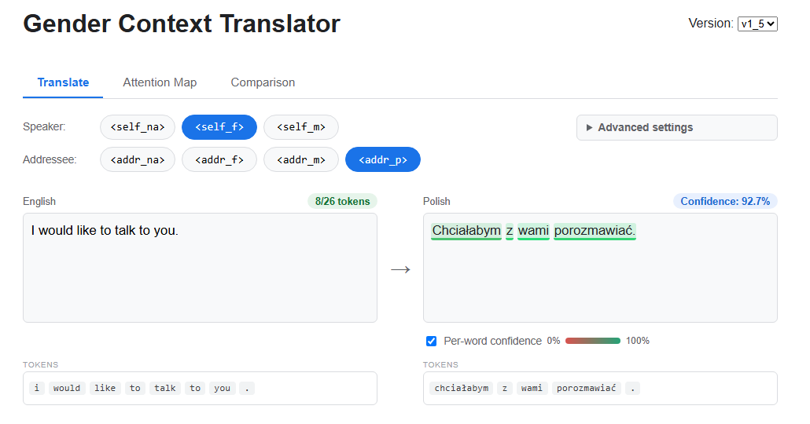

# Gender Context English-Polish Translator

A Transformer English-Polish translator trained from zero in *PyTorch* (no pre-trained weights, no external tokenizers or NLP libraries) - with explicit control over the speaker's and addressee's gender and number in the Polish output.

---

## Motivation

Most translation tools we use work sentence by sentence, with no memory of who's speaking or who's being spoken to. That's rarely a problem in English, but Polish is a heavily gendered language: verbs, adjectives, and even some nouns change form depending on the speaker's and listener's gender and number.

Polish is also going through a genuinely interesting linguistic moment right now: feminine forms of nouns (*feminatywy*), such as **członkini** instead of **członek** are becoming more common - and, depending on who you ask, more accepted... This isn't entirely new territory either: forms like **nauczycielka** ("female teacher") have long been completely standard and uncontroversial.

None of this is something a context-free translator can reason about, and the results can range from mildly inaccurate to unintentionally funny. </br>
<br>

#### As an example, here's a real chain of attempts with&nbsp;<a href="https://translate.google.com"></a>&nbsp;, trying to coax a single sentence into coming out right:
---

```diff
─┬─ Google Translate ───────────────────────────────────
 │ [EN] >> I knew you liked me.
+│ [PL] >> Wiedziałem, że mnie lubisz.
─┴──────────────────────────────────────────────────────
```

- Looks right. But what if "you" is meant to be plural? </br>
<br>

```diff
─┬─ Google Translate ───────────────────────────────────
 │ [EN] >> I knew you (guys) liked me.
+│ [PL] >> Wiedziałem, że mnie lubicie.
─┴──────────────────────────────────────────────────────
```

- Perfect. Now, what if the speaker is female? </br>
<br>

```diff
─┬─ Google Translate ───────────────────────────────────
 │ [EN] >> I (girl) knew you (guys) liked me.
-│ [PL] >> Wiedziałem, że mi się podobam (dziewczyno).
─┴──────────────────────────────────────────────────────
```

- Hmm..., now it treated *"(girl)"* as a part of the sentence, not as a context - "wiedziałem" is still the masculine form. I'm sure dropping  *"(guys)"* will do the job!</br>
<br>

```diff
─┬─ Google Translate ───────────────────────────────────
 │ [EN] >> I (girl) knew you liked me.
-│ [PL] >> Wiedziałem, że ci się podobam.
─┴──────────────────────────────────────────────────────
```

- Nope, same problem, still masculine. One more try, rephrasing more aggressively this time. </br>
<br>

```diff
─┬─ Google Translate ───────────────────────────────────
 │ [EN] >> I (as a girl) knew you guys liked me.
+│ [PL] >> Jako dziewczyna wiedziałam, że mnie lubicie.
─┴──────────────────────────────────────────────────────
```

- There it is - correct speaker gender, correct addressee plurality. But getting there took mangling the English sentence into something nobody would naturally write, purely to smuggle context through a translator that has no way to ask for it directly. </br>
<br>

Of course, this particular example is trivial, and you could just fix "wiedziałem" to "wiedziałam" by hand in a second. But scale it up to a whole document, a story, a hundred-line chat log with this happening throughout, and manual correction stops being just a "quick fix". That's the actual problem this project explores: ***What if the translator itself took the speaker's gender, and whether the listener is a man, a woman, or a group, as explicit input, instead of guessing?***

---
## Approach

*NOTE: This problem is absolutely solvable more easily by prompting an LLM, or by fine-tuning an existing SOTA translation model. This repo
deliberately does neither. The goal wasn't to build the most practical tool, but to understand the problem end to end - from raw subtitle data to a model
that can be told who's speaking and who's being spoken to.*

<br>

### 1. Context as part of the target sequence
---
The model is a standard encoder-decoder Transformer. The English sentence goes into the encoder unchanged - the context is injected on the **decoder
side**, as two reference tokens placed before `<bos>`:

```
<self_f> <addr_p> <bos> Wiedziałam, że mnie lubicie. <eos>
```
<br>
  
There are seven reference tokens in total - three for the speaker and four for the listener: <br>
  
<div align="center">
    
| Token | Meaning |
|---|---|
| `<self_f>` · `<self_m>` · `<self_na>` | female · male · unspecified speaker |
| `<addr_f>` · `<addr_m>` · `<addr_p>` · `<addr_na>` | female · male · plural · unspecified listener |
   
</div>

<br>
During inference, these two tokens are fed in as a fixed prefix and the model generates the rest of the sentence conditioned on them. Since the context
lives outside the English input, it can be changed without touching a single word of the source.<br>

<br>

### 2. Labelling the data by grammar
---
No gender-annotated English-Polish corpus exists, so the labels were derived from the Polish side of *OpenSubtitles*. First and second-person sentences
were mainly classified by their grammatical endings e.g., *-łam / -łem*, *-łabym / -łbym*, *jestem -na / -ny*, etc. for the speaker, *-łaś / -łeś*, *pan / pani*, *jesteś -na / -ny* and *-ście*, *wy*-forms for the listener with additional sentence-structure checks to filter out false matches.

The first-person extraction alone produced **~68k feminine** and **~161k masculine** sentences. The imbalance was even stronger for profession nouns
(*jestem lekarzem*, *jestem nauczycielem*), so a large set of them was converted to feminine forms (*lekarzem -> lekarką*, *prawnikiem -> prawniczką*),
teaching the model the feminine forms the raw subtitles barely contain - while the original masculine sentence is kept too, so the same English sentence appears with both targets (a form of
*counterfactual data augmentation*, cf. Zmigrod et al., 2019). <br>

> [!TIP]
  > The extraction process, including the exact patterns and filtering rules, can be found in
  [`research/Gender_Pronouns_1st_Person.ipynb`](research/Gender_Pronouns_1st_Person.ipynb) (speaker) and
  [`research/Gender_Pronouns_2nd_Person.ipynb`](research/Gender_Pronouns_2nd_Person.ipynb) (listener).
<br>

### 3. Knowing when not to change anything
---
Most sentences don't express gender at all, e.g., *Lubię chodzić do kina.* (*I like going to the cinema.*). Training only on gendered examples made the model overuse gendered forms everywhere
- an early version translated *"I want to talk to you."* with `<self_f>` as *"Chciałam z tobą porozmawiać"* (past tense, just to make it feminine).

The fix is a **reference-token augmentation** applied on the fly during training *(translator-v1_5)*. Every corpus row gets one of three labels per role:
a detected gender, `NA` (a first or second-person sentence whose Polish form carries no gender, ~313k speaker / ~263k listener rows in the
training sample) or `NA_OTHER` (no first/second person at all). For `NA` rows the context token is re-drawn every time the sample is loaded -
`<self_f>`, `<self_m>` or `<self_na>` for the speaker and `<addr_f>`, `<addr_m>` or `<addr_na>` for the listener, while the Polish target stays
the same. The model therefore sees the same neutral sentence under different tokens and learns that the token should only matter when
Polish actually has a choice to make. `NA_OTHER` rows always keep `<self_na>` / `<addr_na>`. Since `<addr_p>` is plural based, it is never drawn by the augmentation.

---

The same sentence from the Google Translate example, this time without rewriting a single word:

```diff
─┬─ Translator-v1_5 ────────────────────────────────────
 │ [EN]  >> I knew you liked me.
 │ [TOK] >> speaker: <self_f> · listener: <addr_p>
+│ [PL]  >> Wiedziałam, że mnie lubicie.
─┴──────────────────────────────────────────────────────
```

The full story of how the gender handling evolved, including evaluation and failure cases, is documented in
[`research/gender_agreement.md`](research/gender_agreement.md).

<br>


---
## Results

Evaluated with [`research/evaluate_gender.py`](research/evaluate_gender.py) - inference only, no retraining. The script reproduces the exact
training sample of each model, builds a held-out set from sentence pairs that were **never sampled for training and are not duplicates of any
training pair**, and checks the output with simple morphological detectors (*-łam/-łem*, *-łabym/-łbym*, *-łaś/-łeś*, *-liście/-łyście*).
Numbers in brackets are 95% confidence intervals. Full report with all tables: [`research/results/eval_summary.md`](research/results/eval_summary.md);
every single output is in [`eval_outputs.csv`](research/results/eval_outputs.csv).

<div align="center">

| What is measured | v1_4 (no augmentation) | v1_5 (augmentation) |
|---|:---:|:---:|
| `<self_f>` produces feminine first-person forms | 80.8% (77–84) | 76.5% (72–80) |
| `<self_m>` produces masculine first-person forms | 88.5% (85–91) | 86.8% (83–90) |
| **both tokens correct on the same sentence** | 78.5% (74–82) | 75.5% (71–79) |
| `<self_na>` on a sentence that needs a gender → no gendered form | 86.2% (83–89) | 36.0% (31–41) |
| **neutral sentence: identical output for f / m / na** | 48.0% (41–55) | **74.5% (68–80)** |
| neutral sentence: gendered form wrongly introduced | 12.5% (9–18) | 6.5% (4–11) |
| `<addr_f>` / `<addr_m>` / `<addr_p>` → matching form | 73.0 / 72.3 / 61.7% | 62.0 / 62.8 / 60.3% |
| chrF / BLEU on general sentences | 41.3 / 20.6 | 41.4 / 21.0 |

</div>

**Summary.** The augmentation in v1_5 did what it was designed for: on first-person sentences that have no gendered form in Polish,
the output stays the same regardless of the speaker token in 74.5% of cases (48.0% for v1_4), and wrongly introduced gendered forms drop
from 12.5% to 6.5%. General translation quality is unchanged.

However, it came at a cost. Explicit control got weaker - clearly for the addressee (73/72% -> 62/63%), within noise for the speaker - and the `na`
tokens changed meaning: given `<self_na>` on a sentence that needs a gender, v1_4 avoids gendered forms in 86% of cases, while v1_5 picks one
in ~63%, slightly more often feminine. My interpretation is that pairing the f/m tokens with neutral targets also taught the model that the
tokens can sometimes be ignored (tuning the augmentation rate would be the obvious next experiment).

In roughly a third of cases the output contains no form the detector recognises - this can be a valid paraphrase (e.g. present tense)
or a mistake; [`eval_outputs.csv`](research/results/eval_outputs.csv) has every output for inspection.

> [!NOTE]
> The earlier per-epoch BLEU in [`research/epoch_selection.ipynb`](research/epoch_selection.ipynb) uses a simplified BLEU (from *Dive into Deep
> Learning*) computed on BPE token ids, on samples that partly overlap the training data - it was only used as a relative signal to pick
> a checkpoint and is not comparable to standard BLEU. The table above replaces it.

---
## Try it

<div align="center">
  
</div>

<br>

The repo comes with a small web app for playing with the model: pick the speaker and listener context, compare all token combinations side by side, and
inspect what the model is actually doing - per-word confidence, attention maps and the BPE tokenization of the input.

### 1. Install

```bash
git clone https://github.com/M4rselo/gender-aware-en-pl.git
cd gender-aware-en-pl
pip install -r requirements.txt
pip install -U huggingface_hub
```

### 2. Download the model

The trained weights and tokenizers are too large for the repo and are hosted on
[Hugging Face](https://huggingface.co/M4rselo/gender-aware-en-pl). Download them straight into `appdata/`:

```bash
hf download M4rselo/gender-aware-en-pl --local-dir appdata
```

Expected layout:

```
appdata/
├── checkpoints/
│   ├── translator_v1_4-13.pt
│   └── translator_v1_5-13.pt
└── model_reference/
    ├── translator_v1_4/   (tokenizer_*.pkl, encoder_*.pkl)
    └── translator_v1_5/
```

> [!WARNING]
> The tokenizers are stored as Python pickles - only load them from this repository's Hugging Face page.

### 3. Run

```bash
python webapp/app.py
```

The app will be available at [http://localhost:5000](http://localhost:5000). Inference runs on the CPU - no GPU required. Only model versions whose
checkpoint is present in `appdata/checkpoints/` are shown.

---
## Under the hood

No pre-trained weights and no external tokenizers were used. The Transformer building blocks (attention, encoder/decoder blocks, positional encoding)
are adapted from the textbook [*Dive into Deep Learning*](https://d2l.ai); on top of that this project adds its own BPE tokenizer, data
pipeline, reference-token conditioning (prefix tokens excluded from the loss), a positional-encoding offset for cached decoding, beam search
with a KV cache, mixed-precision training and the web demo.

<div align="center">

| Component | Details |
|---|---|
| **Tokenizer** | Own Byte Pair Encoding with switch logic (incremental pair counts + lazy-deletion heap), trained separately for English (36k) and Polish (54k) |
| **Model** | Encoder-decoder Transformer: 4 + 4 blocks, 8 heads, `d_model` 512, FFN 1024, dropout 0.3 (~95M parameters) |
| **Training** | ~1.35M sentence pairs (+150k validation), Adam (lr 1e-4), batch 64, mixed precision, gradient clipping |
| **Inference** | Beam search (k = 5) with length penalty (α = 0.6) and decoder cache |

</div>

Training notebooks for every model version are in [`research/training_notebooks/`](research/training_notebooks/), and the reasoning behind the final
checkpoint choice in [`research/epoch_selection.ipynb`](research/epoch_selection.ipynb).

## Limitations

This is a from-scratch model trained on movie subtitles, and it shows.

- **Short sentences only.** The model was trained on sequences of up to 27 tokens; longer inputs are truncated.

- **`<self_na>` isn't fully neutral.** When the speaker's gender is unspecified, the model tends to lean towards feminine forms, or picks up a gender from
the listener token instead of staying neutral:

```diff
─┬─ Translator-v1_5 ────────────────────────────────────
 │ [EN]  >> I am a teacher.
 │ [TOK] >> speaker: <self_na> · listener: <addr_na>
-│ [PL]  >> Jestem nauczycielką.
─┴──────────────────────────────────────────────────────
```
<br>

- **Plural addressees are fragile.** Sentences addressed to a group only come out reliably when `<addr_p>` is set explicitly, and even then, the plural
form doesn't always carry through the whole sentence. Additionally, due to the limited data set for plural sentences, the translation is of noticeably lower quality.

```diff
─┬─ Translator-v1_5 ────────────────────────────────────
 │ [EN]  >> You guys look fantastic.
 │ [TOK] >> speaker: <self_na> · listener: <addr_na>
-│ [PL]  >> Wyglądasz fantastycznie.
─┴──────────────────────────────────────────────────────
 │ [EN]  >> Do you all live in the same city?
 │ [TOK] >> speaker: <self_na> · listener: <addr_p>
-│ [PL]  >> Wszyscy mieszkasz w tym samym mieście?
─┴──────────────────────────────────────────────────────
```
<br>

- **Subtitle-style Polish.** The training data is mostly casual dialogue, so formal or technical text often comes out simplified or awkward.

```diff
─┬─ Translator-v1_5 ───────────────────────────────────────────────────────────────────────
 │ [EN]  >> The primary objective of this project is to enhance operational efficiency
 |          across all departments.
 │ [TOK] >> speaker: <self_na> · listener: <addr_na>
-│ [PL]  >> Głównym celem tego projektu jest zwiększyć produktywność przez wszystkie działy.
─┴──────────────────────────────────────────────────────────────────────────────────────────
```
<br>

- **No tolerance for typos*** Since the model was not trained with typo augmentation, a single typo can completely creak the translation.

```diff
─┬─ Translator-v1_5 ─────────────────────────────────────
 │ [EN]  >> My grandfathr died when I was eight.
 │ [TOK] >> speaker: <self_m> · listener: <addr_na>
-│ [PL]  >> Moja grandfar zmarła, kiedy miałem osiem lat.
─┴───────────────────────────────────────────────────────
```
<br>

- **Lowercase only.** Text is lowercased before tokenization, so the output is lowercase apart from the first letter.

```diff
─┬─ Translator-v1_5 ──────────────────────────────────────────
 │ [EN]  >> My name is John and I have recently been to Paris.
 │ [TOK] >> speaker: <self_m> · listener: <addr_na>
-│ [PL]  >> Nazywam się john i byłem ostatnio w paryżu.
─┴────────────────────────────────────────────────────────────
```
<br>

### What I would do next

- Tune the augmentation rate (e.g. re-draw the token for only part of the `NA` rows) to keep the neutral-sentence stability of v1_5 without losing the explicit control of v1_4.
- Add the typo augmentation: randomly inject character-level noise (swapped, dropped or doubled letters) for most commonly misspelled words.
- Extend the dataset for the plural addressee (`<addr_p>`).
- Extend the counterfactual augmentation from profession nouns to verbs (*-łem <-> -łam*) to balance the 68k / 161k speaker split.
- Add label smoothing and learning-rate warmup, deduplicate the corpus.


---

## References

P. Lison and J. Tiedemann, 2016, [*OpenSubtitles2016: Extracting Large Parallel Corpora from Movie and TV
Subtitles.*](http://stp.lingfil.uu.se/~joerg/paper/opensubs2016.pdf) In Proceedings of the 10th International Conference on Language Resources and
Evaluation (LREC 2016)

A. Vaswani et al., 2017, [*Attention Is All You Need.*](https://arxiv.org/abs/1706.03762) In Advances in Neural Information Processing Systems 30 (NeurIPS
2017)

A. Zhang, Z. C. Lipton, M. Li and A. J. Smola, 2023, [*Dive into Deep Learning.*](https://d2l.ai) Cambridge University Press

R. Zmigrod, S. J. Mielke, H. Wallach and R. Cotterell, 2019, *Counterfactual Data Augmentation for Mitigating Gender Stereotypes in Languages
with Rich Morphology.* In Proceedings of the 57th Annual Meeting of the ACL (ACL 2019)

---

## License

This project is licensed under the [MIT License](LICENSE).
